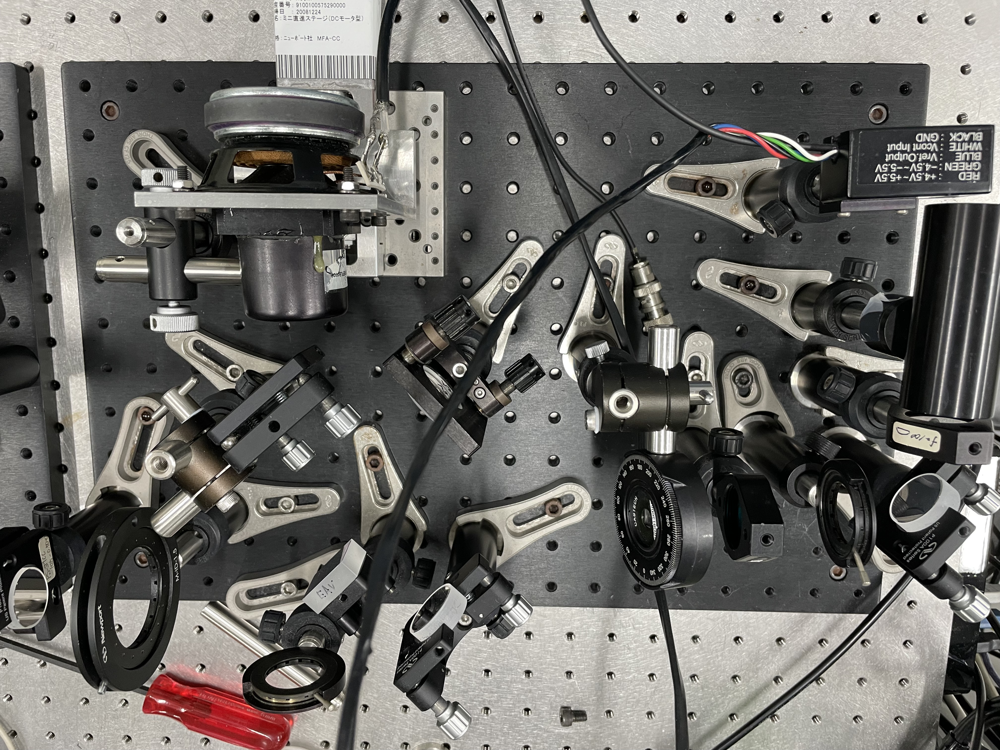
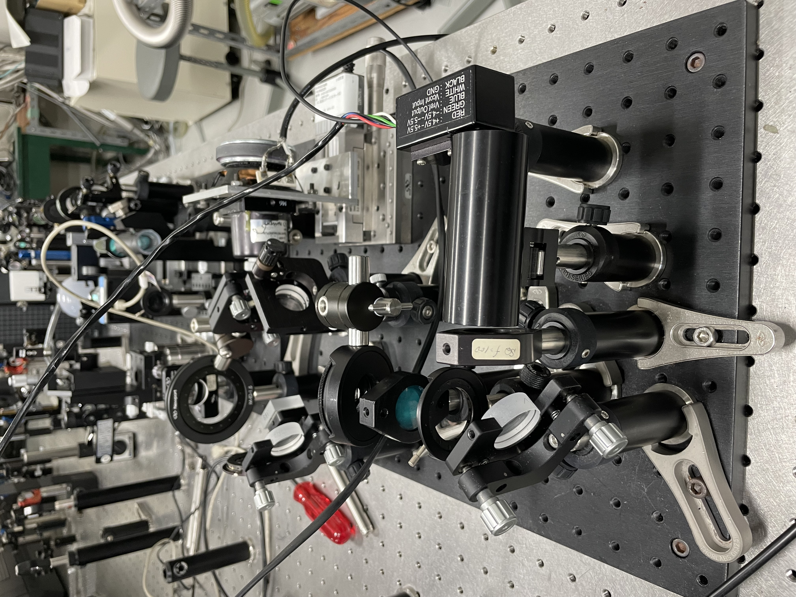
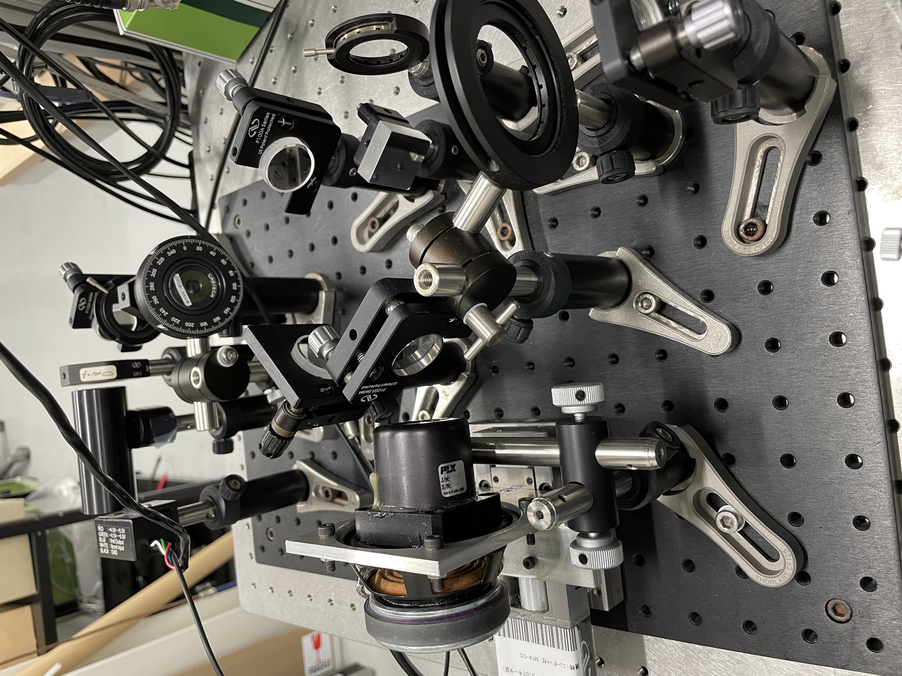
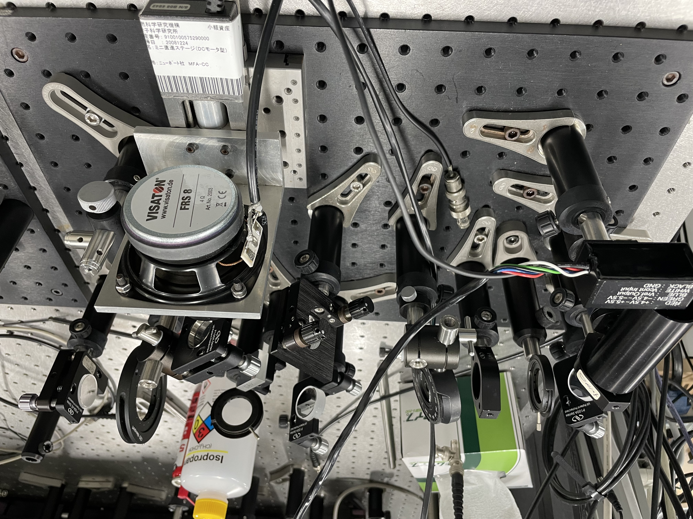
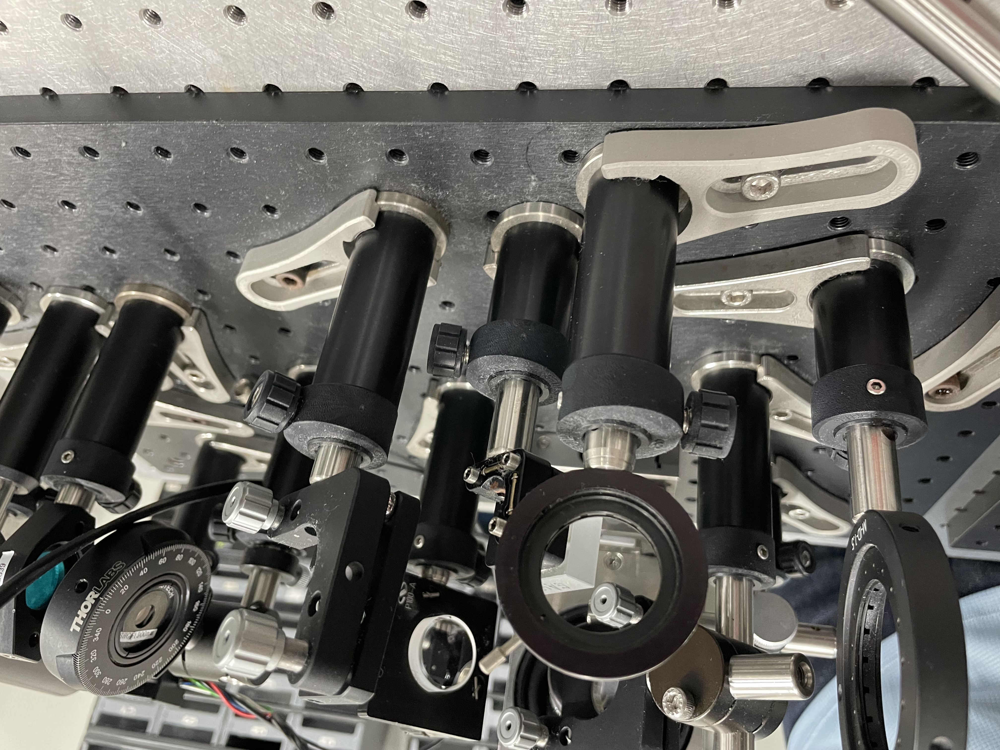

# Lesson 3: Intro to pulsed laser alignment and nonlinear optics

Use the 800 nm pulsed laser tutorial setup

## Review and introduction to new optical components

Quiz on basic optics components from last week.

### New optics
- Retroreflector
- Translation stage
- Lens tube / beam path cover
- Focusing lens and mirror
- Nonlinear crystal
    - Nonlinear susceptibility
    - Properties of Beta Barium Borate
        - high damage threshold
        - Band edges at 0.19 - 3.3 um
        - Useful range 0.21 - 2.1 um
        - Efficient for SHG
        - Narrow angular acceptance bandwidth
    - Second harmonic generation
        - Depends on second-order susceptibility and square of the electric field

### New instruments
- Camera (sensor and lens module)
- Photomultiplier
- Function generator
- Oscilloscope
- DAQ

## Part A

Build an experiment to measure the beam pulse width. This may take a couple of days. Work in pairs or individually. 

1. Use the beam splitter to split the incoming beam before the retroreflector so that one beam is reflected at 90° and is reflected off of two more mirrors before going through the second iris and hitting the curved mirror.
2. The transmitted beam will hit the retroreflector and get reflected to a lower height, hitting the square mirror and finally reflects off of the curved mirror.
3. Adjust the setup so that the two beams cross at about 25 cm from the curved mirror. This is about the focal point of the mirror.

## Part B

Create an SHG signal from both beams, and then spatially and temporally overlap the beams to generate a third SHG beam. Work individually. Each person should be able to create the SHG beam.

1. Use the camera to overlap the beams in the BBO crystal.
2. Adjust the angle of the BBO crystal so that the two exiting beams are about equal in brightness.
3. Use the translation stage to adjust the retroreflector position, adjusting the temporal overlap of the two beams. Watch for a third SHG beam to appear between the original two.
4. Adjust the mirrors so the middle SHG beam goes into the photomultiplier.(Make sure the photomultiplier is at the focal distance of the lens.)

## Part C
Each person collects their own data.

1. Measure characteristics of the femtosecond pulse on the oscilloscope by oscillating the retroreflector at 5 Hz with a function generator. (The retroreflector is mounted on a speaker.) Go to Lesson 3 to learn about oscilloscopes.
2. Use the piezo stage to adjust the temporal delay between the two beams and capture the signal strength in the LabView program.
3. Fit the data to a Gaussian curve to find the pulse width. Curve fitting is covered in a lesson on analysis and lab software.



