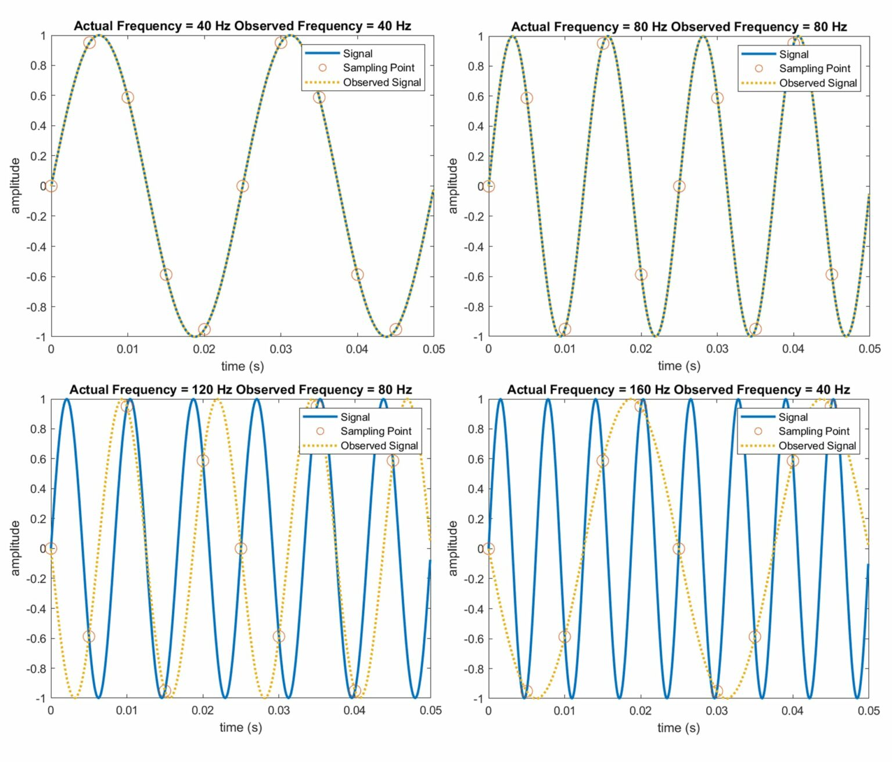

# Appendix B: Using an oscilloscope

This lesson should be completed before measuring the SHG signal in the nonlinear optics lesson.
Make sure to give students the resources linked below so they can learn on their own.

## Goals
1. Understand the basic functions of an oscilloscope
2. Learn how to measure voltage and time using an oscilloscope
3. Learn how to trigger a signal on an oscilloscope

## Functions of an oscilloscope

Graphs a waveform of voltage changing in time. (Voltage axis & time axis)

(A multimeter cannot measure time-dependence)

### Voltage measurements (vertical)
- Voltage peak
- Peak-to-peak
- RMS voltage

### Time & frequency measurements (horizontal)
- Period
- Pulse width

Many functions to measure a waveform

## Three systems (adjustments)

1. Vertical: adjust attenuation or amplification of the signal. (Volts / division)
2. Horizontal: adjust the time base (time / division)
3. Trigger: stabilize a repeating signal or trigger a single event

### Vertical controls

* **Position**: move waveform up and down on the screen. Volts-per-division changes waveform size and vertical step divisions on the screen.
* **Coupling**: DC, AC, ground. How to connect an electrical signal between circuits. Input coupling is the connection from the circuit to the oscilloscope. 
    * DC coupling: shows all of the input signal
    * AC coupling: blocks the DC component so the waveform is centered around zero volts (useful if alternating current + direct current is too large for volts/div setting.
    * Ground: disconnects input signal from the vertical system. You can see where zero volts is on the screen.
        * Grounded input coupling & auto trigger mode — horizontal line on the screen represents zero volts. Switch from DC to ground and back -> can measure signal voltage level wrt to ground.
* **Bandwidth**
    * Bandwidth limit: limiting the bandwidth reduces the noise on the displayed waveform (can also reduce high frequency portion of the signal)
* Termination
* Offset
* Invert
* Scale

### Horizontal controls

* **Acquisition**
* **Sampling**: converting part of an input signal into discrete electrical values.
    * A low sample rate compared to the input wave frequency may degrade or distort the sampled signal. In fact, the minimum sampling frequency must be > 2x the maximum frequency component of the signal to avoid artifacts (Nyquist-Shannon sampling theorem).
* **Position**: similar to vertical position, but for the time domain. Scale the horizontal divisions with sec/div setting.
* **Trigger position**: the trigger function synchronizes the horizontal sweep at the correct point of the signal for a clear display of the signal.
    * Stabilize repeating waveforms and capture single-shot waveforms.
    * Repetitive waveforms are displayed as static. A poorly triggered signal will result in the sweep starting at different places in the signal.

[Oscilloscope Systems and Control](https://jp.tek.com/document/online/primer/xyzs-scopes/ch4/oscilloscope-systems-and-controls#C4section0)

[Sampling Theorem](https://www.liquidinstruments.com/blog/2021/05/18/sampling-theorem/)

[Nyquist-Shannon sampling theorem](https://en.wikipedia.org/wiki/Nyquist–Shannon_sampling_theorem)

