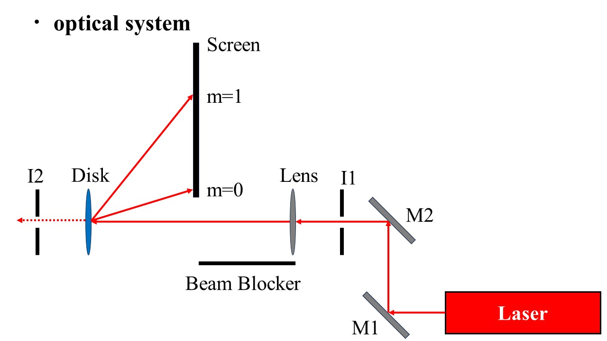
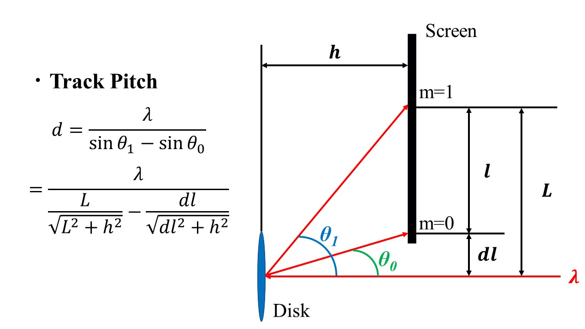

# Lesson 1: Basic Optical Elements and Beam Alignment

Lesson 1 introduces students to basic optical elements and alignment techniques.
It is divided into two parts.
The first part covers basic optical elements, alignment, and safety.
The second part is an experiment to measure the pit width of a CD and DVD.

Remember that tutorials are not lectures but interactive sessions
where students are encouraged to ask questions and participate in the discussion.
They are also encouraged to handle the optical elements and align the beam themselves.

## Part 1: Introduction to Optical Elements and Alignment

### Goals
1. Learn basic optomechanical components (laser, mirrors, irises, posts, etc.)
2. Basic mirror alignment using a laser diode, two mirrors, and two irises
3. Basic laser safety

### Flow
This tutorial is to be completed in five days. Results are presented the following week.

- Day 1: Basic optial elements, laser safety, and practice basic alignment
- Day 2: Review, assign optical disk pit width experiment
- Days 3-4: Optical disk pit width experiment
- Day 5: Review progress

The first lesson is laser safety and practicing alignment using two mirrors and two irises.
Next demonstrate how to align the beam using the red diode laser.
Ask students to try aligning the beam in different ways.
Make it interactive by having them handle the optics and regularly asking questions to check understanding.
Let students *play* with the optics (keeping safety in mind) so they get a feel for how they work.

#### Alignment tips
- Put Mirror 1 close to the laser to limit beam divergence.
- Put Mirror 1 and Mirror 2 close together so we have maximum range of motion for the beam.
- Make the irises as far apart as possible for easier and more precise alignment.
- Bending the path at 90° makes it easier to follow the beam path.

### Questions to ask students
- What happens if the irises are close together? (try it!)
- What happens if the mirrors are far from the laser source?
- What if the mirrors cannot be adjusted to go through both irises?
- What do you need to align the beam along a straight path?

### Laser Safety (basics)
Cover the basics of laser safety first.
Students will take a full laser safety course from the university, but here we emphasize the basics:

- Remove jewelry and reflective objects
- Do not look directly into the laser beam
- Do not look at the beam reflection from a mirror or other reflective surfaces
- Do not point the laser at someone else
- Use a laser card when aligning
- Do not bend down to the beam height; always work above the beam height
- Block the beam before making adjustments to the optics
- Block the beam first if you have to pick something off of the floor or work near beam height
- Always be aware of where the beam is going
- The laser operator is responsible for the safety of everyone in the room
- The beam should be parallel to the table surface

Demonstrate the laser card and how to use it to find the beam.
Also demonstrate how improper beam blocking can lead to the beam escaping the table and potentially endangering others.

### Optical elements
The following optical elements should be introduced:
- Mirror
- Mirror mount
- Post
- Post holder
- Base plate
- Fork
- Diode laser

Be sure to explain the purpose of each element and how they are used in an optical setup, as well as safety precautions.
When explaining, let students handle and assemble the components.
For example, have them assemble a post holder with a post and a mirror mount.

Cover the following details for each element:

#### Mirrors
- Beam should hit close to the center (so there is room for adjustment later)
- Do not touch the mirrors (a laser can burn organic molecules, which can damage the mirror or mirror coating)
- Do not blow on the optics
- Handle the mirrors using a mirror mount as much as possible (not with your hands)
- Direct handling of mirrors should be done with gloves

#### Mirror holders
- Use knobs to make small adjustments in x and y

#### Irises
- Irises help align beam in correct direction at correct height
- Once you align the beam, don’t touch the iris
- Irises also block scattered light
- Use a collar or the post lock (on some ThorLabs post holders) on the post holder to fix the iris height.

## Part 2: Optical disk pit width experiment (CD and DVD)

### Goals
- Apply alignment techniques learned previously
- Have them find accurate theoretical values for the pit width
- Properly present results

### Flow
1. Review the alignment procedure
2. Explain principles of how a CD/DVD works
3. Have students measure the pit width of a CD and DVD
4. Have students calculate the pit width using the formula for the diffraction limit
5. Have students present their results

### Review
- What is the purpose of the irises?
- What safety precautions must you take when working with a laser?
- What should you do if you need to pick something up off the floor while working with a laser?
- How do you make fine adjustments to the beam path?
- We have a red and green laser. What are their wavelengths? (633 nm, 533 nm)

### Experiment description
Write a schematic of the optical setup on the board.
List the components used in the experiment.
They must describe the setup in their presentation.
When helping the students, drop hints to help them figure out the setup and understand sources of experimental error.

### Questions to ask students
- How does the pit width change with the wavelength of the laser?
- How does reading a CD or DVD work?
- When the beam hits a pit, what happens?
- When then laser beam hits a pit that is a half wavelength deep, what happens?

Arrange the experiment setup before the students arrive:

### Presentation requirements

- Purpose
- Principles of the experiment and procedure
- Schematic of the setup
- A picture of diffracted light hitting the screen
- Optical elements and their description
- Results
- Error analysis and sources of error (compare to literature values with references)
- Considerations for improving accuracy

### Reflection grating formula

The formula for the pit width is derived from the reflection grating formula:

$$m \lambda = d (\sin\theta_{m} - \sin\theta_{0})$$
    
where $m$ is the diffraction order, $\lambda$ is the incident laser wavelength, $d$ is the pit width, $\theta_{m}$ is the angle of the diffraction for order $m$, and $\theta_{0}$ is the angle of the zeroth order diffraction.
Angles $\theta_{m}$ and $\theta_{0}$ are related to the x and y coordinates of the beam:

$$\sin\theta_{m} = \frac{x^2}{\sqrt{x^2 + y_{i}^2}}$$

$$\sin\theta_{0} = \frac{x^2}{\sqrt{x^2 + y_{0}^2}}$$

Assume $\theta_0 \approx 0$ for this tutorial.

#### Notes
- CD pit width: 1.6 μm
- DVD pit width: 0.74 μm
- Literature values may differ slightly

