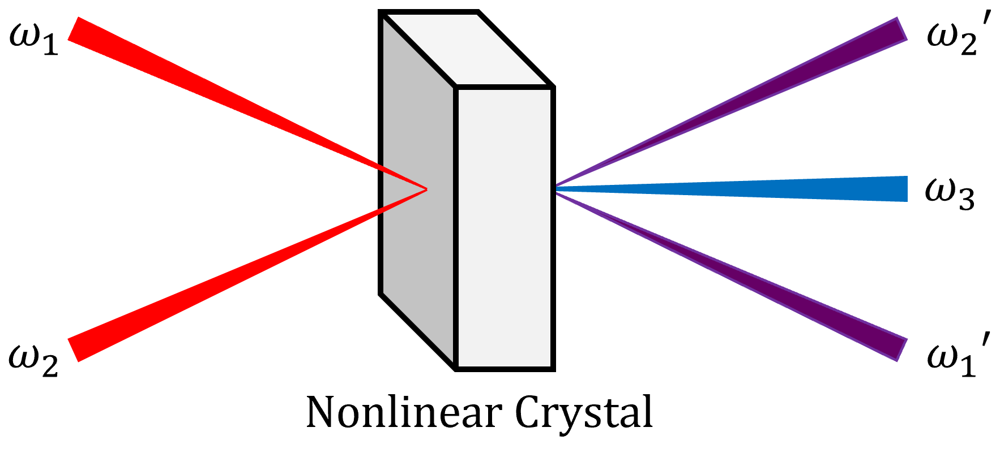
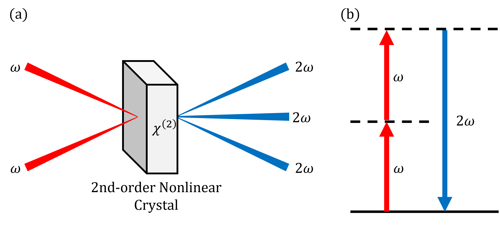

# Lesson 3 handout

## 1. Introduction

### 1.1 Nonlinear Optics

Nonlinear optics (非線形光学) investigates phenomena arising from changes in the optical characteristics of a material due to exposure to light, often from a laser. The term "nonlinear\" refers to the material's response to the applied laser's optical field. Specifically, this nonlinearity is characterized by how the material's polarization (偏光), denoted as $\mathbf{P}(t)$, varies with the strength of the applied electric field (電界), represented as $\mathbf{E}(t)$. In our fundamental optics, we treated this generated polarization as a linear function of the electric field:

$$ \mathbf{\tilde{P}}(t) = \mathbf{P}^{(1)}(t) =  \epsilon_0\chi^{(1)}\mathbf{E}(t),$$

where we called $\chi^{(1)}$ the linear optical susceptibility (敏感) and $\epsilon_0$ is the permittivity of free space. In general, however, polarization can be expressed as a power series of the applied electric field:

$$ \mathbf{P}(t) = \epsilon_0\chi^{(1)}\mathbf{E}(t) + \epsilon_0\chi^{(2)}\mathbf{E}^2(t) + \epsilon_0\chi^{(3)}\mathbf{E}^3(t) + ...,$$

where $\chi^{(2)}$ is called the second-order *nonlinear* optical susceptibility, $\chi^{(3)}$ is the third-order *nonlinear* optical susceptibility, and so on. 

A material, typically a crystal, whose linear susceptibility ($\chi^{(1)}$) is much greater than the nonlinear optical susceptibilities ($\chi^{(2)}$, $\chi^{(3)}$, ...) is called a *linear crystal*. For a linear crystal, the polarization contributions of the higher, nonlinear terms can be neglected. Hence, the first equation is used for this case. An example of linear crystals are Calcite (CaCO3) and quartz (SiO2), which are both commonly used to demonstrate birefringence (複屈折). On the other hand, there are crystals whose nonlinear optical susceptibilities are significant enough so that their polarization contributions can not be neglected. These type of crystals are called *nonlinear crystals* and they are utilized in a wide-range of optics experiments due to their capability to exhibit interesting optical effects.

### 1.2 Second-Order Nonlinear Polarization, $\mathbf{P}^{(2)}(t)$

Let us consider a nonlinear crystal whose second-order nonlinear optical susceptibility is much more significant than the other susceptibility (*i.e.*, $\chi ^{(2)} >> \chi ^{(1)}, \chi ^{(3)}, ...$). The polarization that this crystal generates can be called as the second-order nonlinear polarization, which is given by:

$$ \mathbf{P}^{(2)}(t) = \epsilon_0\chi ^{(2)}\mathbf{E}^2(t).$$
    
To see what will happen if we use a second-order nonlinear crystal, let us consider a simple experimental setup shown in the given figure below.

*Two beams at different frequencies* ($\omega_1$ *and* $\omega_2$) *are
incident to a nonlinear crystal. Under appropriate configuration, a
third beam at a different frequency,* $\omega_3$, *can be
generated.*

Here, the two beams apply a total electric field strength of

$$ \mathbf{E}(t) = E_1e^{-i\omega_1 t} + E_1^*e^{i\omega_1 t} + E_2e^{-i\omega_2 t} + E_2^*e^{i\omega_2 t},$$

to the crystal. Using equation the above equation, the resulting second-order nonlinear polarization generated in the crystal can be written as

$$ \mathbf{P}^{(2)}(t) = P^{(2)}(0) + P^{(2)}(t) + \left[P^{(2)}(t)\right]^*.$$

The first term in the above equation is a polarization contribution at $\omega = 0$:

$$P^{(2)}(0) = 2\chi^{(2)}\left[E_1E_1^* + E_2E_2^* \right],$$

which leads to a process known as *optical rectification* in which a static electric field is created within the nonlinear crystal. On the other hand, the second term (the third term is just its complex conjugate) represents polarization contributions from the sum and difference of $\omega_1$ and $\omega_2$: 

$$ P^{(2)}(t) = \chi^{(2)}\left[E_1^2e^{-i\left(2\omega_1\right) t} + E_2^2e^{-i\left(2\omega_2\right) t} + 2E_1E_2e^{-i\left(\omega_1+\omega_2\right) t} + 2E_1E^*_2e^{-i\left(\omega_1-\omega_2\right) t}\right].$$

*These contributions are responsible for generating radiation at a
different frequency*. Specifically, the first two terms in the above equation correspond to the second-harmonic generation (SHG), where the generated radiation has a frequency of $2\omega_1$ or $2\omega_2$. The third term of the above equation corresponds to the sum-frequency generation (SFG), where the generated radiation has a frequency equal to the sum of $\omega_1$ and $\omega_2$. Then, the last term corresponds to the difference-frequency generation (DFG), where the generated radiation has a frequency equal to the difference of $\omega_1$ and $\omega_2$. Note that if one of the two beams is not present (which is equivalent to the case where $\omega_1$ or $\omega_2 = 0$), we can still observe SHG (*why is that so?*).

In ordinary experiments, the so-called *phase-matching* between the nonlinear crystal and the incident beams will also determine the characteristic of the outgoing beams. For example, if the *phase-matching condition* is not completely met, the outgoing beams may still have their original beam travelling in the same line with its own SHG beam (e.g., $\omega_1'=\omega_1, 2\omega_1$ and $\omega_2'=\omega_2, 2\omega_2$). Practically speaking, you can choose which components will be radiated by properly selecting the polarization of the incident beam and the orientation of the nonlinear crystal.

---
Reference: Chapters 1 & 2 of the Nonlinear Optics (2nd Ed.) by Robert W.
Boyd

## 2. Practice Experiment: Second-Harmonic Generation via Sum-Frequency Generation

### Overview and Objective

For this tutorial, the main goal is to introduce you to another set of optics and instruments, and use these to demonstrate one of the interesting phenomena in nonlinear optics—the second-harmonic generation (SHG) through Sum-Frequency Generation (SFG) (see Figure below)

*A setup demonstrating Second-Harmonic Generation (SHG) via Sum-Frequency Generation (SFG): (a) geometry of the interaction assuming that the spatial, temporal, and phase-matching conditions are satisfied, and (b) its energy-level description.*

You will use a single laser source to create two beams at equal frequency, $\omega_1 = \omega_2 = \omega$, then direct these beams to hit the same spot of a second-order nonlinear crystal. This will satisfy the *spatial overlap condition*. This condition will make sure that the two beams will interfere at the same point inside the crystal. Then, you will make sure that the two beams have the same optical path length. This will satisfy the *temporal overlap condition*. This second condition will make sure that the two beams are also in-phase when they interfere in the crystal. By satisfying these conditions, together with the phase-matching condition that you can meet by adjusting the orientation of the crystal, you can generate a third beam at the second-harmonic frequency, $2\omega$. In terms of wavelength, the SHG beam will have a wavelength half the incident beam's wavelength, *i.e.* $\lambda/2$. Therefore, your SHG beams will have a different color from your laser source.

### Optics and Instruments

- Laser source ((a) a guide beam will be used in the start as you build and align your setup; (b) the actual pulsed laser will be used after when your setup is ready for testing)
- mirrors
- irises
- beam splitter
- retroreflector
- optical filter
- translation stage
- lens tube with a beam path cover
- Beta Barium Borate (BBO) nonlinear rystal
- photomultiplier
- camera (sensor and lens module)
- oscilloscope
- data acquisition (DAQ) instrument.

### Procedures
**IMPORTANT**: The following optics are fixed in the optical breadboard and will serve as your starting setup:

1. the first iris, where the guide beam and the actual pulsed laser will pass through

2. the retroreflector, which is mounted on a speaker and is on top of a translation stage

3. the second iris

4. the curved mirror.

In addition, the height of these
optics are already optimized to the height of the actual pulsed laser so it is recommended not to adjust their heights unless, for some reason, they really needed to be adjusted.

#### Part A - Satisfy the Spatial Overlap Condition

1. Use a beam splitter to split the incoming beam. Place it in between the first iris and the reftroflector so that one beam is transmitted straight to the retroreflector and the other beam is reflected 90° with respect to the transmitted beam.

2. Using two mirrors, direct the reflected beam so that it will go through the second iris and hit the curved mirror.

3. Using the square mirror, direct the transmitted beam (which is reflected to a lower height by the retroreflector) so that it will also go through the second iris and hit the curved mirror.

4. Adjust the setup so that both beams are:
    
    a. traveling in a straight line as they hit the curved mirror. A preliminary check is to make sure that the two beams are vertically aligned on the surface of the curved mirror. Another way to check (a stricter one) is by removing the curved mirror and then check if the height of each beam is not changing significantly after several centimeters;
    
    b. crossing (intersecting) at the focal point of the curved mirror, which is about 25cm from the surface of the curved mirror. You can use an iris to check if the two beams are overlapping at the focal point.

    *After doing the steps above, your setup is now ready to be tested using the actual pulsed laser. Depending on the situation, it may also mean that you need to relocate your setup to where the actual pulsed laser is going to enter.*

5. Place the BBO crystal at the focal point.

6. Place a camera module, which is connected to a monitor, a few centimeters behind the BBO crystal. You may need to adjust the camera's position so that it is focused at the surface of the BBO crystal. Further optimize the overlap of the beams.

##### Conceptual Questions

- Given the same laser source, are there other nonlinear crystal that can be used in this SHG experiment?

- Why is it recommended that the two beams overlap at the focal point of the curved mirror? What will happen if you overlap the two beams away from the focal point?

#### Part B — Satisfy the Temporal Overlap Condition

1. Adjust the angles of the BBO crystal so that you will see two outgoing SHG beams having similar brightness.

2. Use the translation stage to adjust the retroreflector position. While adjusting, watch for another beam to appear between the original two SHG beams. This generated beam is your third SHG beam.

##### Conceptual Questions

- How is timing of each beam at the overlap relates to their respective optical path length?

- Why the third SHG beam appears in between the two SHG beam and not elsewhere?

- Assuming there is no loss of energy in the experiment, how the energy (or intensity) of the third SHG beam relates to the energy (intensity) of the two SHG beams?

#### Part C — Measure the Third SHG Beam

1. Place the optical filter after the BBO crystal so that only the third SHG beam will pass through.

2. Use a mirror to reflect the third SHG beam to a lens. A lens tube, whose length is roughly equal to the focal distance of the lens, is also attached to the lens to minimize unwanted light.

3. Place the photomultiplier at other end of the lens tube. You need to connect it to a power supply and to an oscilloscope to make sure that it is detecting the third SHG signal.

4. Connect the translation stage to a dedicated control system and use a dedicated LabView program to finally measure the third SHG beam signal.

5. Depending on the situation, you can also use a function generator and a DAQ instrument to assist you in measuring the third SHG signal.

6. Fit the data to a Gaussian curve to find the pulse width of your third SHG beam.

##### Conceptual Questions

- How can you verify that it is the third SHG beam that passed through the optical filter?
- The intensity of the detected signal changes as the translation stage moves during the measurement. Why is that so? What does it mean if the detected intensity is at its maximum/minimum?
